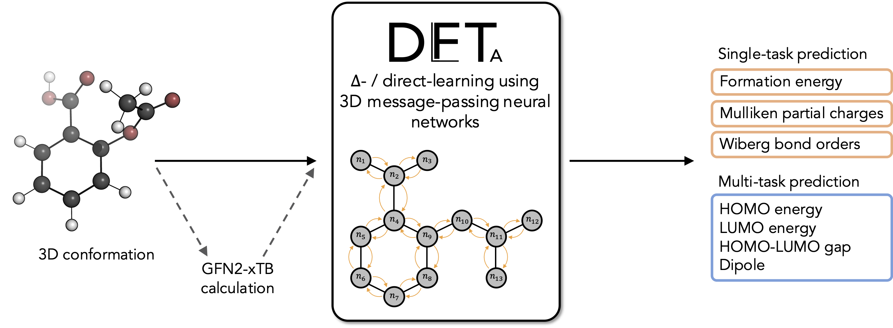

# DelFTa: Open-source Δ-quantum machine learning for medicinal chemistry


[](https://github.com/josejimenezluna/delfta/actions/workflows/build.yml)
[](https://anaconda.org/delfta/delfta)
[](https://delfta.readthedocs.io/en/latest/?badge=latest)
[](https://codecov.io/gh/josejimenezluna/delfta)


## Overview 
The DelFTa application is an easy-to-use, open-source toolbox for predicting quantum-mechanical properties of drug-like molecules. Using either ∆-learning (with a GFN2-xTB baseline) or direct-learning (without a baseline), the application accurately approximates DFT reference values (*ω*B97X-D/def2-SVP). It employs 3D message-passing neural networks trained on the QMugs dataset of quantum-mechanical properties, and can predict formation and orbital energies, dipoles, Mulliken partial charges and Wiberg bond orders. See the [paper](https://pubs.rsc.org/en/content/articlehtml/2022/cp/d2cp00834c) for more details (version 1.0.0 used in this work).

## Installation

We currently only support Python 3.8 and 3.9 Linux builds.

### Installation via conda

We recommend and support installation via the [conda](https://docs.conda.io/en/latest/miniconda.html) package manager, and that a fresh environment is created beforehand. Then fetch the package from our channel:

```bash
conda install delfta -c delfta -c pytorch -c rusty1s -c conda-forge
```


### Installation via Docker

A CUDA-enabled container can be pulled from [DockerHub](https://hub.docker.com/r/josejimenezluna/delfta). 

We also provide a Dockerfile for manual builds:

```bash
docker build -t delfta . 
```

Attach to the provided container with:

```bash
docker run -it delfta bash
```

## First run

DelFTa requires some additional files (_e.g._ trained models) before it can be used. Execute the following in order to fetch those:

```bash
python -c "import runpy; _ = runpy.run_module('delfta.download', run_name='__main__')"
```

## Quick start

We interface with Pybel (OpenBabel). Most molecular file formats are supported (_e.g._ .sdf, .xyz).

```python
from openbabel.pybel import readstring
mol = readstring("smi", "CCO")

from delfta.calculator import DelftaCalculator
calc = DelftaCalculator()
preds = calc.predict(mol)

print(preds)
```


Further documentation on how to use the package is available under [ReadTheDocs](https://delfta.readthedocs.io/en/latest/).

## Tutorials

In-depth tutorials can be found in the `tutorials` subfolder. These include: 

- [delta_vs_direct.ipynb](tutorials/delta_vs_direct.ipynb): This showcases the basics of how to run the calculator, and compares results using direct- and Δ-learning models. 
- [calculator_options.ipynb](tutorials/calculator_options.ipynb): This dives into the different options you can initialize the calculator class with. 
- [training.ipynb](tutorials/training.ipynb): A simple example of how networks can be trained. 


## Citation

If you use this software or parts thereof, please consider citing the following BibTex entry:

```
@article{atz2022delta,
  title={$\Delta$-Quantum machine-learning for medicinal chemistry},
  author={Atz, Kenneth and Isert, Clemens and B{\"o}cker, Markus NA and Jim{\'e}nez-Luna, Jos{\'e} and Schneider, Gisbert},
  journal={Physical Chemistry Chemical Physics},
  volume={24},
  number={18},
  pages={10775--10783},
  year={2022},
  publisher={Royal Society of Chemistry}
}
```
