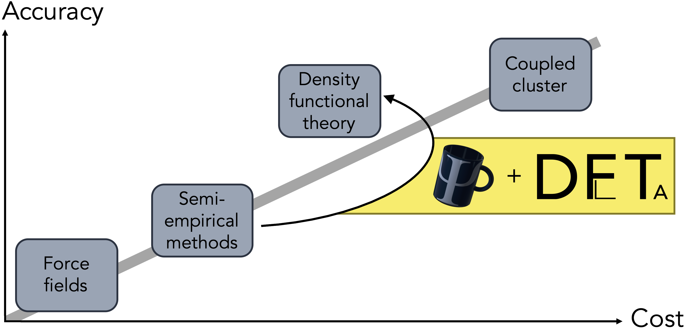

# DelFTa: Open-source Δ-quantum machine learning


[](https://github.com/josejimenezluna/delfta/actions/workflows/build.yml)
[](https://codecov.io/gh/josejimenezluna/delfta)


## Installation

### Pre-requisites

Currently supported operating systems include both Linux and macOS (x86_64 only). Basic build tools (_e.g_. make) are currently required for installation. Under Ubuntu, for instance, these are available under the `build-essential` package. The required package might be named differently on different distributions.

While the Linux installation fully supports GPU-acceleration via cudatoolkit, only CPU inference is currently available under Mac OS.

### Installation via conda

We recommend and support installation via the [conda](https://docs.conda.io/en/latest/miniconda.html) package manager. First clone the repository to obtain the latest version or download one of the provided stable releases:

```bash
git clone https://github.com/josejimenezluna/delfta
```

Afterwards, move into the root repo directory and build the provided Makefile via:

```bash
make
```

which will create a new conda environment named `delfta` and install all the required dependencies as well as this package according to the requirements of your host operating system. After the installation has completed, you can now activate the environent and use the package via

```bash
conda activate delfta
```


### Installation via Docker

We also provide a CUDA-enabled Dockerfile for easier management. Build the container by

```bash
docker build -t delfta . 
```

Attach to the provided container with:

```bash
docker run -it delfta bash
```

## Quick start

```python
from openbabel.pybel import readstring
mol = readstring("smi", "CCO")

from delfta.calculator import DelftaCalculator
calc = DelftaCalculator(tasks="all")
preds = calc.predict(mol)

print(preds)
```


Further documentation on how to use the package is available under [ReadTheDocs](http://toinclude.html).

## Tutorials

In-depth tutorials can be found in the `tutorials` subfolder. These include: 

- [delta_vs_direct.ipynb](tutorials/delta_vs_direct.ipynb): This showcases the basics of how to run the calculator, and compares results using direct- and Δ-learning models. 
- [calculator_options.ipynb](tutorials/calculator_options.ipynb): This dives into the different options you can initialize the calculator class with. 


## Citation

If you use this software or parts thereof, please consider citing the following BibTex entry:

```
@article{atz2021delfta,
  title={DelFTa: Open-source delta-quantum machine learning},
  author={Atz, K., and Isert, C., and B\"{o}cker, M., and Jiménez-Luna, J., and Schneider G.},
  journal={TBD},
  year={2021},
}
```
